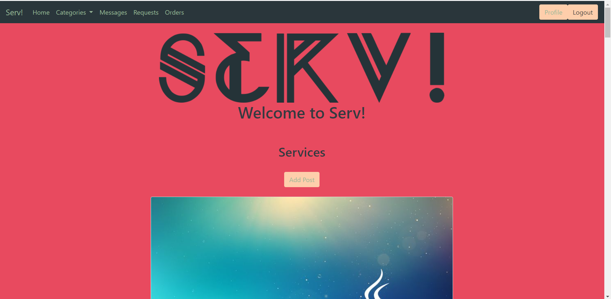
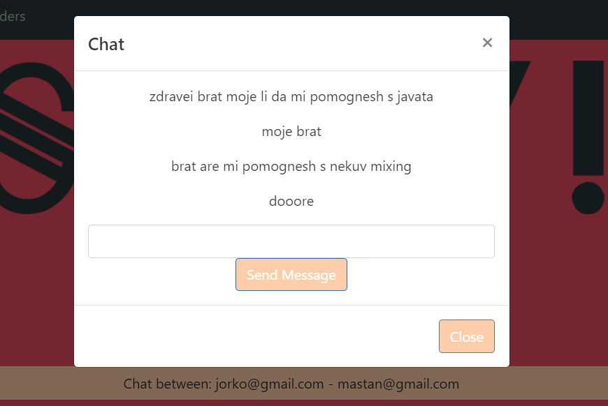

# Serv Freelance Platform

Serv! is a platform where different types of people can offer their services in a simple and reliable way.

## Description
Serv! is a platform where people of all trades can offer their services in exchange for money. It is also a place where someone in need of a certain skillset can easily find it for the price that suits them. The online platform provides simplicity and reliability, safe payments with Stripe and easy communication between customer and worker.

## Features
Serv! offers the ability to browse, filter and create posts which act as your own personal ad for your services. Name, description, duration and price can be set and also an image that represents your work. 
As a user requests can be made towards service providers which can then be accepted or declined. Once an order is accepted and created the customer and worker can communicate via the messaging system and arrange whatever they need to accomplish their tasks on the platform. Once the work on an order has been completed the user is provided with the option to pay via card using Stripe which is secure and no credit card details are stored on the platform. 

## Visuals
Some visuals from the platform.

This is the home screen where you can browse posts!

This is the chat screen!

## Installation
The backend of the platform is built using Java Spring and Maven as the aim is to be deployed using Heroku. Building it on your machine should be easy as all that is needed is included in the pom.xml file and after downloading all the needed dependencies it should be smooth sailing from then on. The application.properties file should be configured to point to your local repository. This particular build uses Hybernate and MySQL to create the necessary tables.

The fronted is built using HTML, CSS, JavaScript and the Bootstrap library for styling. For communication with the REST API we are utilizing Axios.
During the development the fronted was hosted using XAMPP with an Apache server.

All the ports are included in the respective files and can be altered based on your configuration on your local machine.

## Authors and acknowledgment
The project was built by Denislav Berberov with the help of other fellow bootcamp colleagues.

## License
MIT License

## Project status
The project is in a working state but other features were planned which could not be implemented at this point.
Such features are:
- Reporting users and sellers who are trying to scam others
- Admin panel where admins can check out reports and contact possible mischievous users
- Search bar to find posts based on keywords which might be included in the description or title
